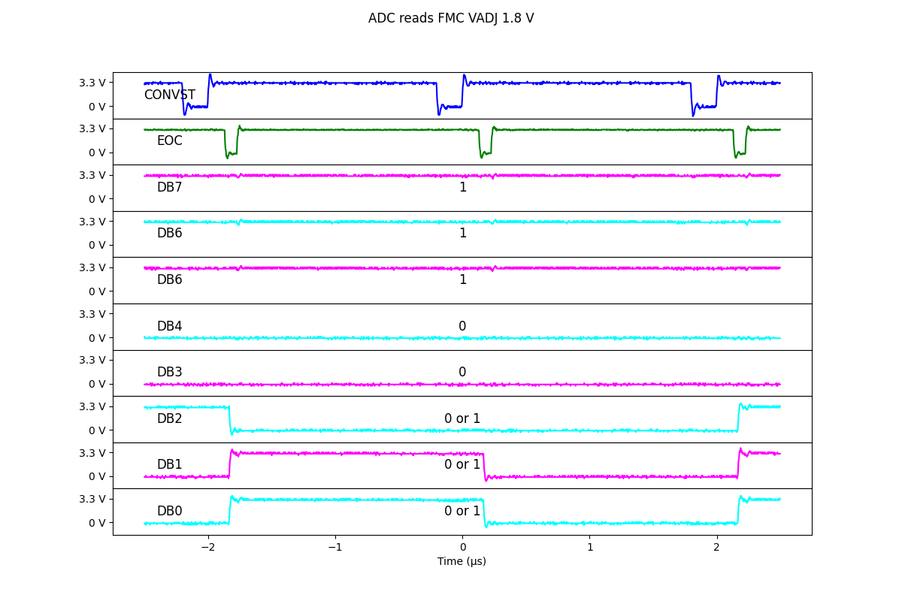

讀取FMC板的VADJ(1.8 V)  
讀取結果為1110_0XXX  
換算成十進制為224到231  
2 V X 224/256 為 1.75 V  
2 V X 231/256 為 1.804 V  
  
  
[AD7822BNZ](https://www.mouser.tw/ProductDetail/Analog-Devices/AD7822BNZ?qs=%2FtpEQrCGXCyXv71BkCSjyQ%3D%3D)  
[Data Sheet](https://www.mouser.tw/datasheet/2/609/AD7822_7825_7829-3119929.pdf)  