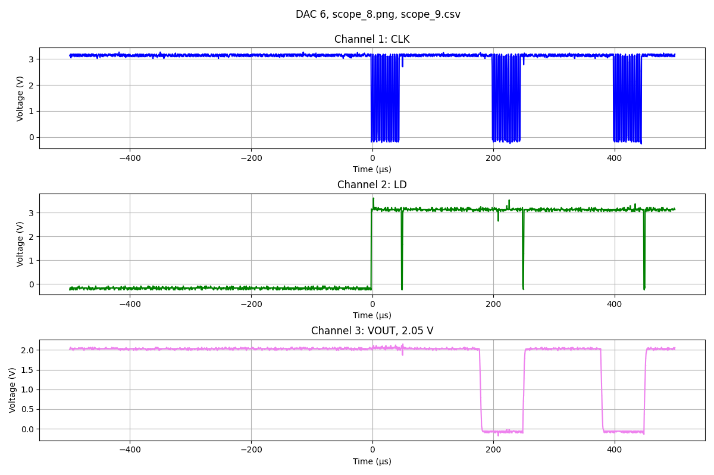
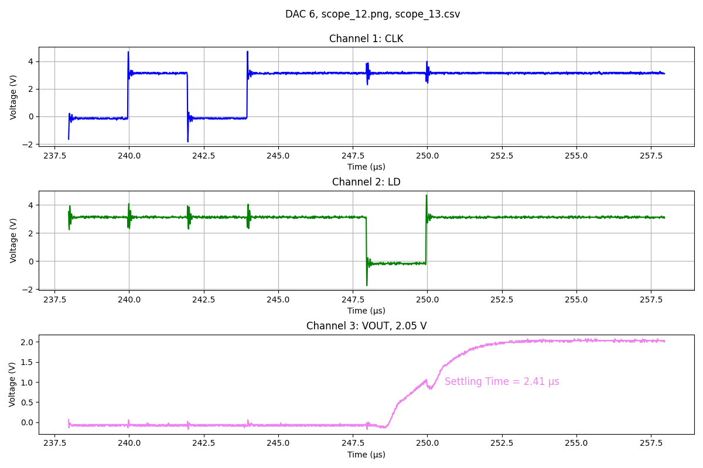
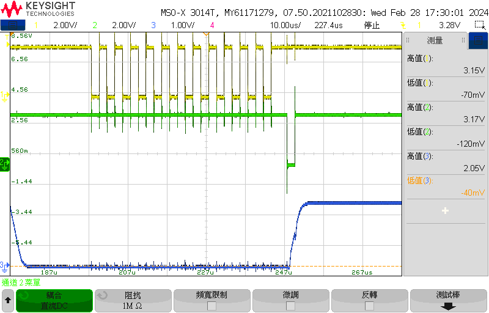
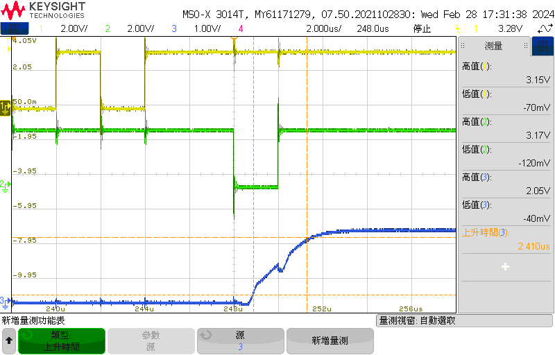

  
  
  
  
  
  
  
Pin 1: VDD，接 3.3 V，接上 0.1 μF 和 10 μF 的去耦電容。。  
Pin 2: CS，接 GND。  
Pin 3: CLK，接 CLK。  
Pin 4: SDI，接 SDI。  
Pin 5: LD，接 LD。  
Pin 6: CLR，接 CLR。  
Pin 7: GND，接 GND。  
Pin 8: Vout。  
  
tLD1: 2 states，大於 15 ns。  
tCL:  2 states，大於 30 ns。  
tCH:  2 states，大於 30 ns。  
tDS:  大於 15 ns。  
tDH:  大於 15 ns。  
tLD2: 4 states，大於 10 ns。  
tLDW: 150 states，大於 20 ns。  