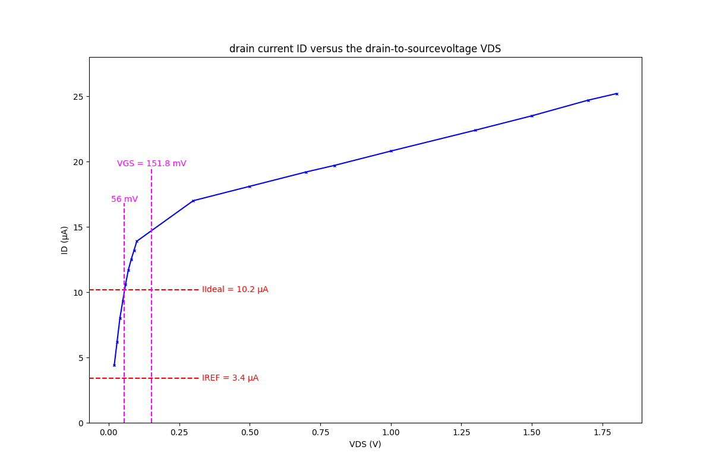
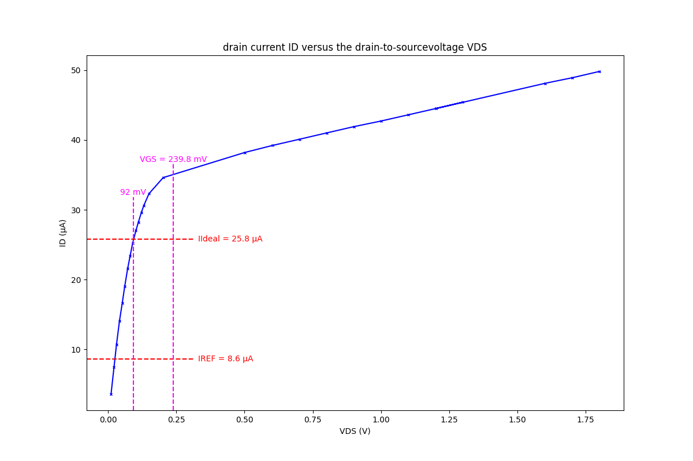

測試條件: IREF = 3.4 μA
  
測試條件: IREF = 8.6 μA
  
  
[ALD110800APCL](https://www.mouser.tw/ProductDetail/Advanced-Linear-Devices/ALD110800APCL?qs=mdoy1eHU51x%2FBo2oDnWvZw%3D%3D)  
[Data Sheet](https://www.mouser.tw/datasheet/2/8/ALD110800-1489.pdf)  