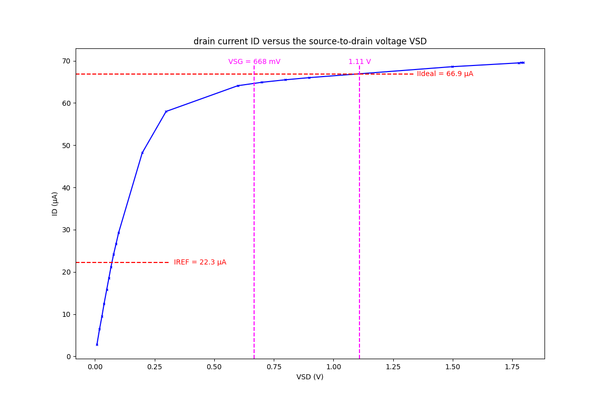
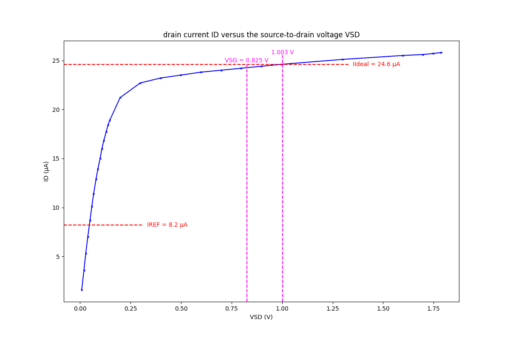

測試條件: IREF = 22.3 μA
  
測試條件: IREF = 8.2 μA
  
  
[ALD1107PBL](https://www.mouser.tw/ProductDetail/Advanced-Linear-Devices/ALD1107PBL?qs=mdoy1eHU51wGpQ0zzvyyZg%3D%3D)  
[Data Sheet](https://www.mouser.tw/datasheet/2/8/ALD1107-10401.pdf)  