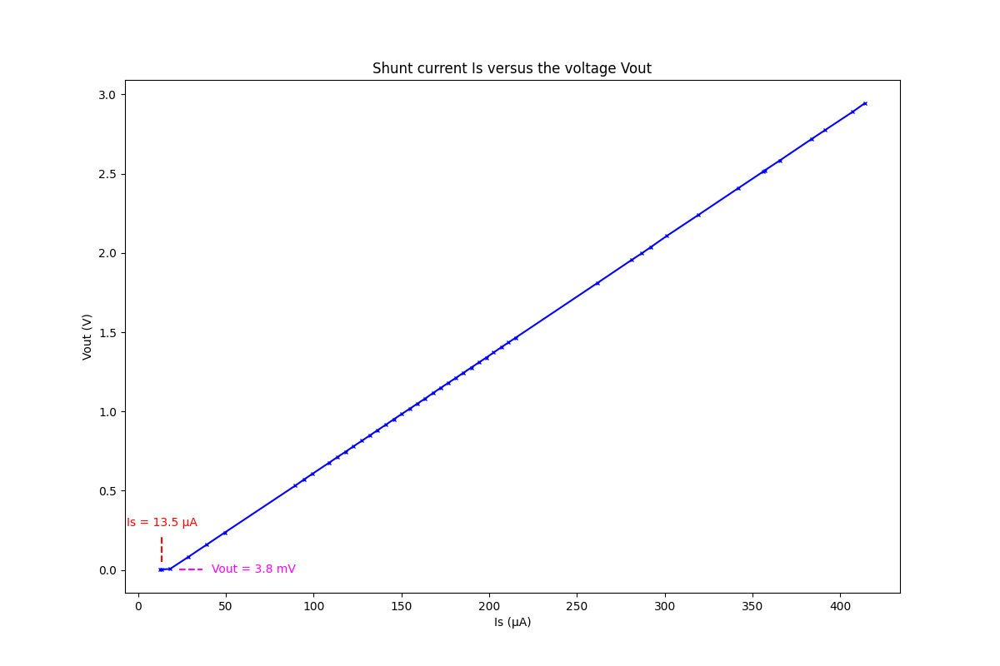

電阻選用 15 Ω
測試結果:  
  
  
[INA310A5IDGKR](https://www.mouser.tw/ProductDetail/Texas-Instruments/INA310A5IDGKR?qs=ulEaXIWI0c9sKuCYLaAY4g%3D%3D)  
[Data Sheet](https://www.ti.com/lit/ds/symlink/ina310b.pdf?ts=1706015127637&ref_url=https%253A%252F%252Fwww.mouser.tw%252F)  