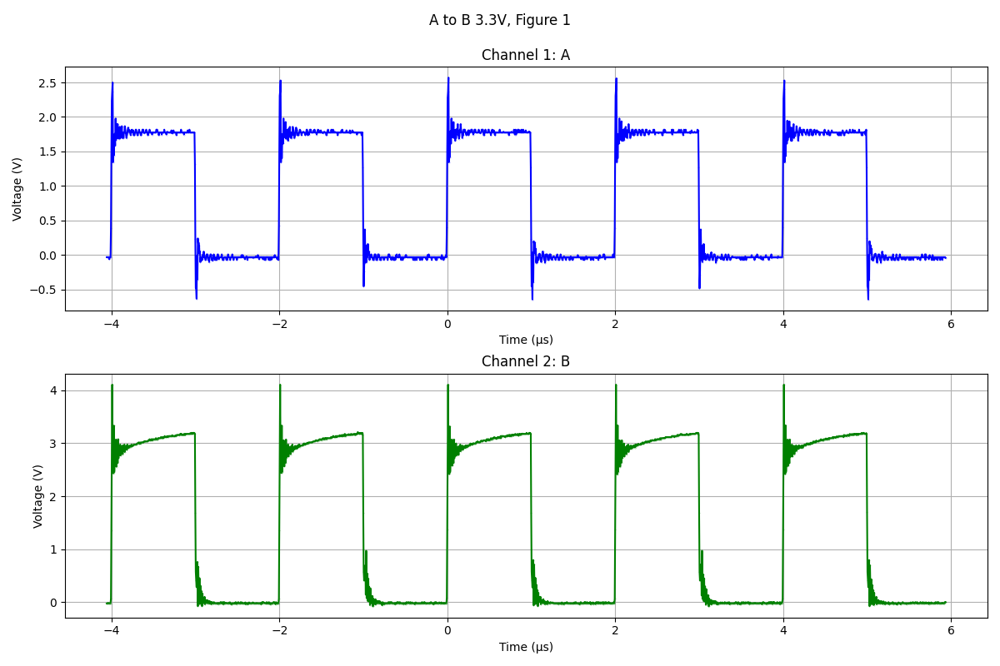

測試結果:  
A to B 3.3V:  
  
   
  
A to B 2.5V:  
  
  
  
B to A 3.3V:  
  
 
  
[TXS0108EQPWRQ1](https://www.mouser.tw/ProductDetail/Texas-Instruments/TXS0108EQPWRQ1?qs=4BLsKd%2FIMYCjsiJW21Sqxg%3D%3D)  
[Data Sheet](https://www.ti.com/lit/ds/symlink/txs0108e-q1.pdf?ts=1706466073737&ref_url=https%253A%252F%252Fwww.ti.com%252Fproduct%252FTXS0108E-Q1%253Futm_source%253Dgoogle%2526utm_medium%253Dcpc%2526utm_campaign%253Dasc-int-null-44700045788370269_prodfolderdynamic-cpc-pf-google-eu_int%2526utm_content%253Dprodfolddynamic%2526ds_k%253DDYNAMIC%2BSEARCH%2BADS%2526DCM%253Dyes%2526gad_source%253D1%2526gclid%253DCjwKCAiAk9itBhASEiwA1my_63l412J8xp7idAYW3wb5JJ96OaW7MBQJ5M5O72oUiCf66rtPXouoMhoCBEEQAvD_BwE%2526gclsrc%253Daw.ds)  