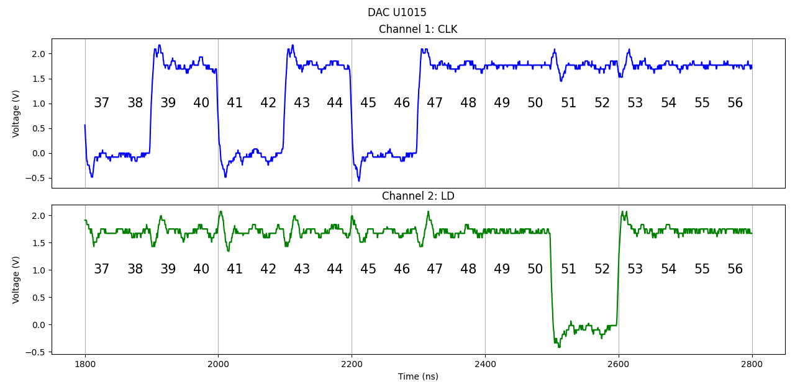

# DAC 波形測試  
分別測試 PCB 板上`U1004 DAC`和`U1015 DAC`的波形。  
  
輸入的訊號為`010101010101`，換算成電壓大約為`1.10 V`。  

兩者使用相同`Vivado`專案但改變`DAC`腳位而已。  
  
每五百個`state`會重製一次，故週期為`25 μs`。  
```v
always@(*) begin
        case(state)
            10'd499:  nextstate = 10'd0;
            default: nextstate = state + 1'd1;
        endcase
end
```
  
# Vivado  
輸入時鐘使用`20 MHz`，輸出至 DAC 的 CLK 頻率為 `5 MHz`。  
  
其中每一個`state`所佔時長為`50 ns`。  
```v
always@(*) begin
    case(state)
        ..........
        // D2 CLK
        10'd37, 10'd38: dac_signals_4[3] = ZERO;
        10'd39, 10'd40: dac_signals_4[3] = ONE;
        // D1 CLK
        10'd41, 10'd42: dac_signals_4[3] = ZERO;
        10'd43, 10'd44: dac_signals_4[3] = ONE;
        // D0 CLK, LSB
        10'd45, 10'd46: dac_signals_4[3] = ZERO;
        10'd47, 10'd48: dac_signals_4[3] = ONE;
        default: dac_signals_4[3] = ONE;
    endcase
end
```
   
  
# 測試結果比較  
  
  
  
# DAC U1004 測試結果  
  
  
Channel 3 改觀測`mux_signals`中的`EN`訊號。  
```v
// mux_signals
always@(*) begin
    case(state)
        10'd0: mux_signals = 8'b00000000;
        10'd180, 10'd181: mux_signals = 8'b00100010;
        default: mux_signals = 8'b00000000;
    endcase
end
```
  

# DAC U1015 測試結果  
  
  