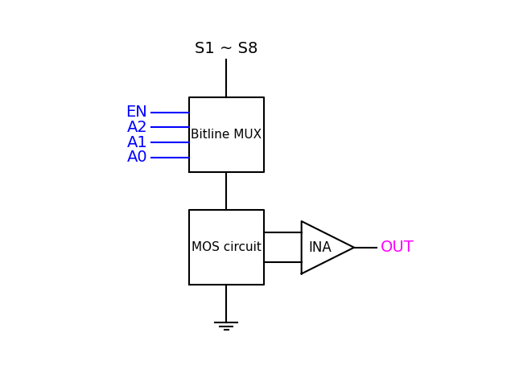

# Bitline MUX  
此 Verilog 檔負責控制 BL 端的 MUX。  
  
## 程式說明  
此程式輸入要有五個控制訊號，分別為 Reset、EN_in、A2_in、A1_in 和 A0_in。   
  
此程式輸出要產生四個控制訊號，分別為 EN_out、A2_out、A1_out 和 A0_out。  
  
當 Reset 訊號為 0 時，四個輸出控制訊號皆輸出 0。  
  
不同輸出控制訊號組合如下:
|EN_out|A2_out|A1_out|A0_out|MUX Pin 10|
|:--:|:--:|:--:|:--:|:--:|
|0|X|X|X|無輸出|
|1|0|0|0|S1|
|1|0|0|1|S2|
|1|0|1|0|S3|
|1|0|1|1|S4|
|1|1|0|0|S5|
|1|1|0|1|S6|
|1|1|1|0|S7|
|1|1|1|1|S8|
  
## 電路圖  
BL 一部分電路如下圖所示:
  
  
## IC  
IC 為 ADG1408LYCPZ。  
[ADG1408LYCPZ-REEL7](https://www.mouser.tw/ProductDetail/Analog-Devices/ADG1408LYCPZ-REEL7?qs=1Kr7Jg1SGW%2FDLWV%2Fv6ZJUw%3D%3D)  
[Data Sheet](https://www.mouser.tw/datasheet/2/609/adg1408l-3365138.pdf)  