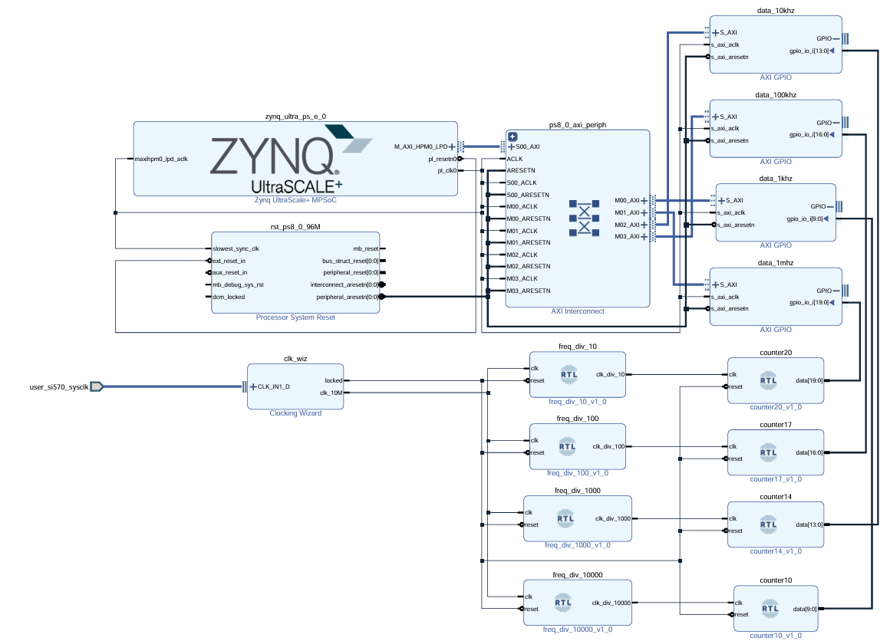
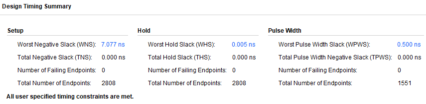

# GPIO 速度測試  
測試`GPIO`是否讀取正常。  
  
## Block Diagram  
  
  
## Design Timing Summary  
  
  
## 1 kHz 測試結果  
直接讀取不加延遲。  
```python
for i in range (10):
    print(f"data_1kHz[{i}] is", data_1kHz.read(0))
```
結果:  
```text
data_1kHz[0] is 425
data_1kHz[1] is 425
data_1kHz[2] is 426
data_1kHz[3] is 426
data_1kHz[4] is 426
data_1kHz[5] is 426
data_1kHz[6] is 426
data_1kHz[7] is 427
data_1kHz[8] is 427
data_1kHz[9] is 427
```
因此`print`和`read`操作低於`1 ms`即可完成。  
  
讀取加延遲`1 ms`。  
```python
for i in range (10):
    print(f"data_1kHz[{i}] is", data_1kHz.read(0))
    time.sleep(0.001)
```
結果:  
```text
data_1kHz[0] is 294
data_1kHz[1] is 297
data_1kHz[2] is 298
data_1kHz[3] is 300
data_1kHz[4] is 302
data_1kHz[5] is 304
data_1kHz[6] is 305
data_1kHz[7] is 307
data_1kHz[8] is 308
data_1kHz[9] is 309
```
延遲有`1 ms`、`2 ms`和`3 ms`不固定。  